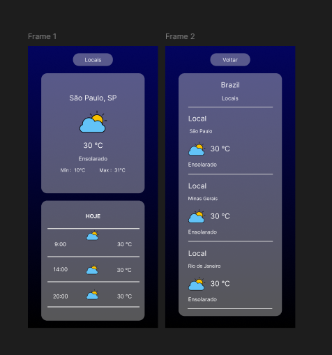

# 🌤️ ClimaApp

Aplicação web que exibe as condições climáticas em tempo real de cidades brasileiras, com previsão do tempo para manhã, tarde e noite.

---

## 📸 Preview



---

## 🚀 Funcionalidades

- Exibe temperatura atual, mínima e máxima do dia
- Mostra condição climática com ícone em tempo real
- Previsão do tempo para 3 períodos do dia (manhã, tarde e noite)
- Tela de locais com clima de 3 estados brasileiros (SP, RJ e MG)
- Navegação entre telas

---

## 🛠️ Tecnologias

- HTML5
- CSS3 (Flexbox e Grid)
- JavaScript (ES6+)
- [WeatherAPI](https://www.weatherapi.com/) — API de clima em tempo real

---

## 📁 Estrutura do Projeto

```
climaapp/
├── index.html
├── brasil.html
└── assets/
    ├── css/
    │   ├── index.css
    │   └── brasil.css
    └── js/
        ├── index.js
        └── brasil.js
```

---

## ⚙️ Como rodar localmente

1. Clone o repositório:
```bash
git clone https://github.com/J0A0PAULO/climaapp.git
```

2. Abra o arquivo `index.html` no navegador ou use o Live Server do VS Code

> Não é necessário instalar dependências — o projeto é 100% vanilla JS

---

## 🌐 Deploy

Acesse o projeto em produção:

> Link do deploy — adicione após publicar na Netlify

---

## 👨‍💻 Autor

Feito por [J0A0PAULO](https://github.com/J0A0PAULO)
